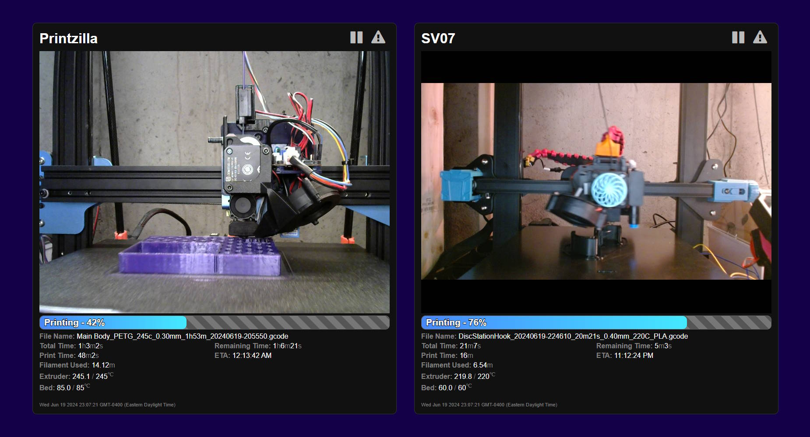

# KlippyDash
Lightweight Klipper Dashboard built on Moonraker API

## Why?
Mainsail and Fluidd are great for control, but I was looking for a lightweight dashboard that shows only the information I care about.  I wanted something that could handle multiple printers and would display cleanly on both desktop and mobile.

A great use case for this is Device UI/print_host_webui setting in [Orcaslicer](https://github.com/SoftFever/OrcaSlicer).  KlippyDash will give you a view of whats happening, without adding unnecessary bloat to Orcaslicer.

## Features
* Camera View
  * Snapshot refreshes every second rather than streaming.  Will stream on mouse hover.
* Printing Metrics
  * Filename
  * Extruder Temp
  * Bed Temp
  * Print Times & Estimates
  * Filament Used
* Dynamic Controls - show the controls that matter based on print state.
  * Pause
  * Resume
  * Cancel
  * E-Stop
 * Lightweight - I like to leave a tab open all the time to monitor.  Both Mainsail and Fluidd use more resources than I would like for this use case.   Currently I have one printer running Mainsail using 160mb of browser memory and one running Fluidd using 243mb of memory where KlippyDash is using 63mb (based on Chrome tab memory).
 
## Warning!
Before we move on, this project currently doesn't have much (any?) security features baked in and I am comfortable with that in my environment. But make sure you understand the implications of the moonraker.conf changes required to make this work in your environment, especially if you want to run it from a local folder.

## Installation 
1. Host files on webserver of choice on a private network.  
   * You can open this from a local folder if you configure your CORS policy appropriately.  This is only recommended in non-prod environments per moonraker documentation.
3. Edit moonraker.conf - documentation here: https://moonraker.readthedocs.io/en/latest/configuration/#authorization
   * Ensure \[trusted_clients\] is configured correclty for your network/server.
   * Ensure \[cors_domains\] is configured correctly for your network/server
4. Edit settings.js
5. Profit?

## TODO
* Add authentication
* Add additional metrics
  * Speed
  * Flow
  * Layer Counts?
  * System Stats (load/cp/mem)
* Add additional basic controls
  * Restart firmware / Klipper
  * Home / Temp Presets
* Update to Websockets

